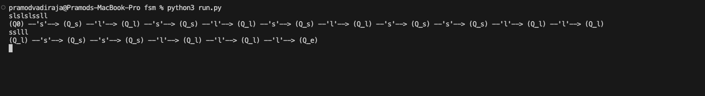
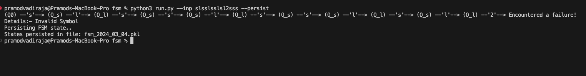
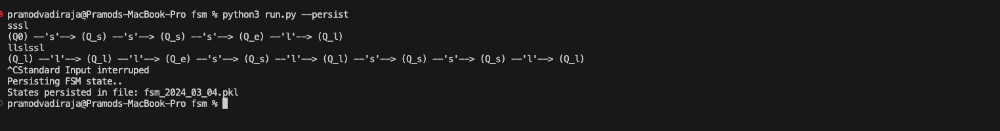

#### Finite State Machine
A Demo repository showcasing a generic implementation of a Finite State Machine along a toy problem: `Candy Counter` that leverages this framework. The high-level designs and assumptions can be found in [design.ipynb](images/design.ipynb) notebook

##### Quick Start:
There are multiple command line options to test the script [run.py](run.py) such as static input, via file or the standard input, To restore a persisted fsm etc. Here are some examples:-

- Simple way to test the script is to run: 
`python3 run.py`  
With this, we enter the standard input where we can start typing symbols.

- To specify the input as a string and persist when failure (eg invald symbol or Keyboard Interrupt), you can use the options `--inp` and the `--persist` flags respectively as shown:

- To restore a saved machine use the `--restore` flag as shown:

