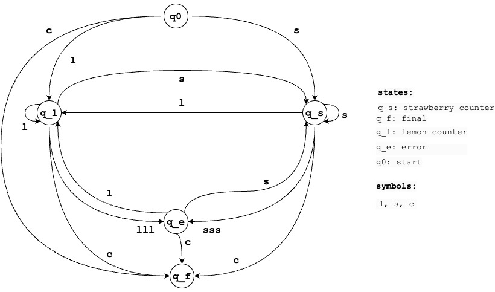

## Finite State Machine (FSM)
A Demo showcasing a generic implementation of a Finite State Machine along with a toy problem: `Candy Counter` that leverages this framework.
### UML Design of the FSM

### State machine for the ToyProblem: Candy Counter
A machine that counts lollipops in a conveyor belt that fails when count of similar lollipops encoutered is 3.

#### Assumptions:
- Lemon and Strawberry flavored lollipops identified by the symbols '`l`' and '`s`' are counted using their respective counters idenfitied by the states ($q_{l}$) and ($q_{s}$).
- Termination state $q_{f}$ can be reached at any point by the symbol '`c`'
- The possible causes for error state ($q_{e}$):
    - `lll` or `sss` are seen
- To persist machine state during unforeseen failures in the machine, the following situations are considered as failures:
    - Unknown symbol encountered by the machine
    - KeyboardInterrupt error if the input symbol is accepted via standard input

### Quick Start:
The [run.py](run.py) script is used to test the toy problem. Configurations to the machine can be specified via the respective flags  such as command line, file or standard input, to restore a persisted FSM etc. Here are some examples:-

- To run the script b y providing inputs via the standard-input: 
`python run.py`  

- To specify the input as a string and persist when failure (eg invald symbol or Keyboard Interrupt), you can use the options `--inp` and the `--persist` flags respectively as shown:

- To restore a saved machine use the `--restore` flag as shown:

 Some more responses of the script can be found in [test_results.ipynb](test_results.ipynb) notebook.